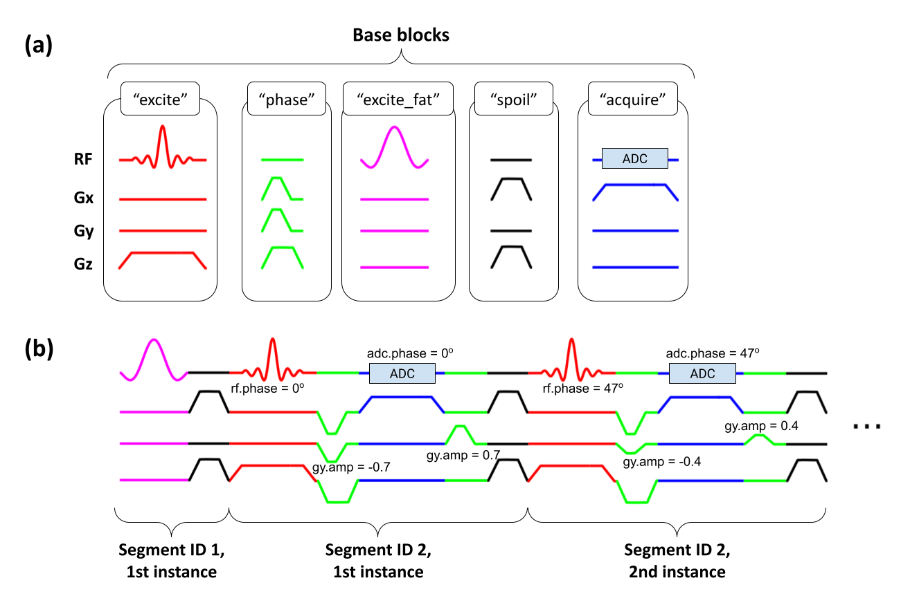

# A vendor-agnostic representation of MRI pulse sequences

<!--  -->

This repository contains MATLAB code for converting a 
[Pulseq](https://pulseq.github.io/) 
MRI pulse sequence file
to a format suitable for GE (and perhaps other) scanners.

For usage information and examples, and for a description
of the Pulseq GE interpreter and its relation to the current repository, 
see: https://github.com/HarmonizedMRI/SequenceExamples-GE/tree/main/pge2.

The idea behind this repository is to represent an MRI pulse sequence as a 
(typically small) collection of **segments**, 
with each segment consisting of a fixed sequence of base blocks.
A segment is typically played out multiple times during the scan with different
RF/gradient amplitudes, RF/DAQ frequency/phase offsets, etc:



This sequence representation allows efficient and accurate implementation
of a Pulseq sequence on the GE MRI platform.

**Update December 2025**:
The branches have been renamed:
```
Previous branch name         Current branch name
tv7                    ==>   main (default)
main                   ==>   tv6_v1.9
develop                ==>   tv6_v1.10
```

From now on, development will happen in short-lived feature branches.

For tv6, use the 'tv6\_v1.9' or 'tv6\_v1.10' branches.
These older branches are no longer being actively supported.


