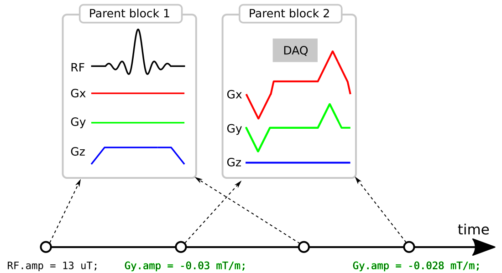

# PulCeq

A C representation of arbitrary MR pulse sequences, based on the "scaled parent block" (SPB) description.

The idea is to represent the sequence as a (typically small) collection of parent/prototype
[Pulseq](https://pulseq.github.io/)
blocks, that are played out repeatedly during the scan with different
RF/gradient amplitudes, RF/DAQ frequency/phase offsets, etc:

The goal of this repository is to provide a **community standard** specification
for encapsulating this sequence description in C code.

This specification is contained in the ./src/ folder, which contains the following:
* **pulseq.h**: defines `Seq`, a nested struct containing the entire sequence, and
function prototypes (interfaces) for various tasks including
   * serializing to file
   * allocating and freeing up memory

