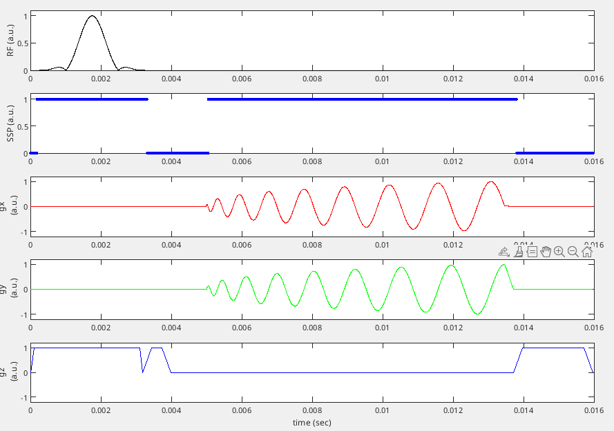

# Functions for checking and inspecting a 'Ceq' sequence representation

This folder contains the `+pge2` namespace, which defines functions for
checking a Ceq object before writing it to a  .pge file with `writeceq.m`.
However, ultimately, GE's 
[WTools simulator](https://github.com/jfnielsen/TOPPEpsdSourceCode/blob/UserGuide/v7/simulate.md) 
and the accompanying 'Pulse View' plotter
is the best way to test and visualize a .pge file before going to the scanner;
the functions provided here serve as an early and quick, but probably incomplete, check.


## Check compatibility with scanner hardware using pge2.validate()

The function `pge2.validate()` provided here tries to identify any
issues with the Ceq object before writing it to file with `writeceq.m`.
Example:

```matlab
% Convert a Pulseq file to a Ceq sequence object (a nested struct)
ceq = seq2ceq('gre2d.seq');

% Define hardware parameters
psd_rf_wait = 150e-6;  % RF events are delayed by this amount to account for gradient delay (s)
psd_grd_wait = 120e-6; % ADC window is delayed by this amount to account for gradient delay (s)
b1_max = 0.25;         % Gauss
g_max = 5;             % Gauss/cm
slew_max = 20;         % Gauss/cm/ms
gamma = 4.2576e3;      % Hz/Gauss
sys = pge2.getsys(psd_rf_wait, psd_grd_wait, b1_max, g_max, slew_max, gamma);

% Check if 'ceq' is compatible with the parameters in 'sys'
pge2.validate(ceq, sys);

% Modify ceq until the above call returns no errors

% Write sequence to file
writeceq(ceq, 'gre2d.pge');
```

As usual, see 
https://github.com/HarmonizedMRI/SequenceExamples-GE/tree/main/pge2
for further details and the most up to date information.

## Plotting a base segment, and importance of SSP lock-out periods

To plot the first base segment from the 2d spiral example in this repository, do:
```matlab
cd SequenceExamples-GE/pge2/spiral
main;   % Write a Pulseq file and convert to a Ceq object
sys = pge2.getsys(150e-6, 100e-6, 0.25, 5, 20, 4.2576e3);
S = pge2.constructvirtualsegment(ceq.segments(1).blockIDs, ceq.parentBlocks, sys, true);
```



This shows the waveforms with normalized amplitude,
which is how the segment is represented in hardware during the sequence download step
(prior to entering the scan loop).  
Note the 'SSP' waveform, which indicates lock-out periods during which only one of the following events can take place:
* RF event
* ADC event
* the first 4us time interval of a pure delay block
* TTL ('trigger') out window
The lock-out periods include the RF/ADC dead- and ringdown-times.
Overlapping SSP commands are a common reason for failed downloads on the scanner, 
which can usually be resolved by inserting extra gaps around RF and ADC events.


## Units

Units used here is a mix of Pulseq and GE conventions, and are as follows:
```
RF:                  Gauss (typical GE hardware limit is 0.25 G)
Gradients:           Gauss/cm    
Slew rate:           Gauss/cm/ms
Times:               sec
gyromagnetic ratio:  Hz/Gauss  (4257.6 Hz/Gauss for 1H)
```
